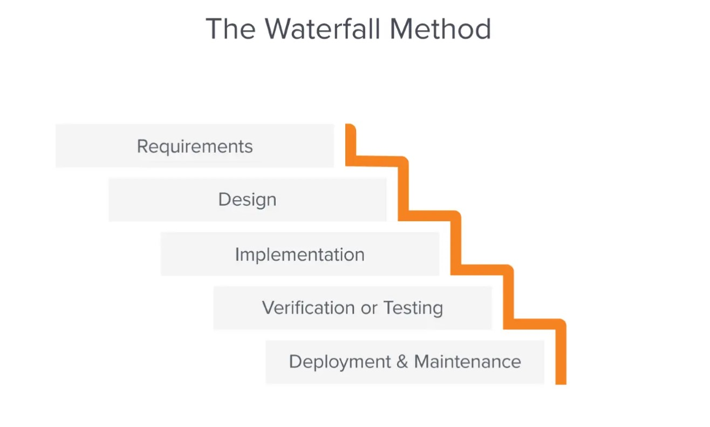
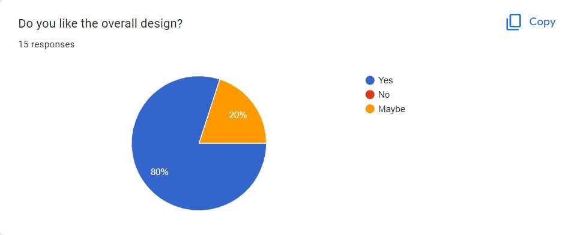
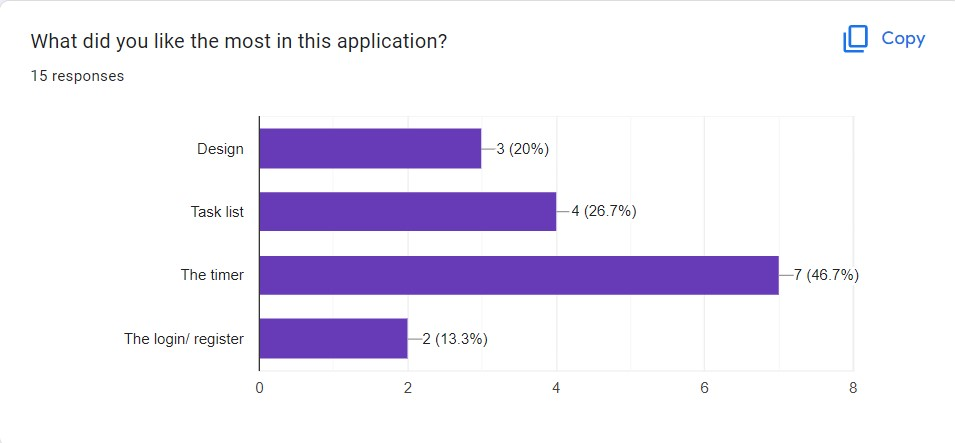
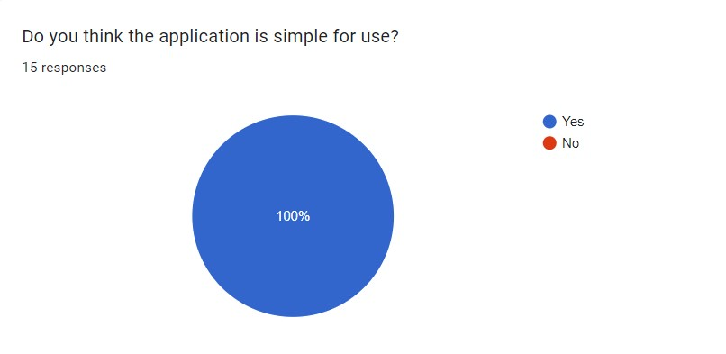
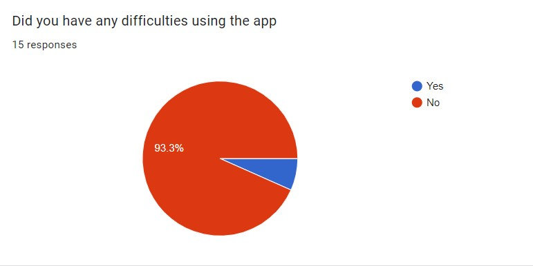
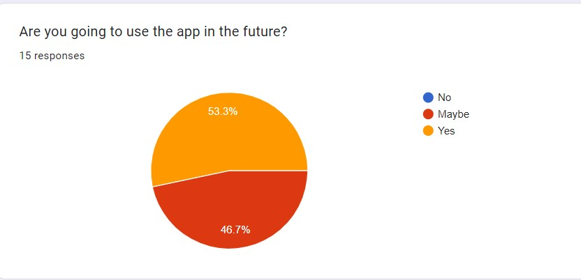
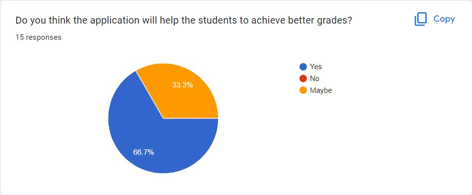
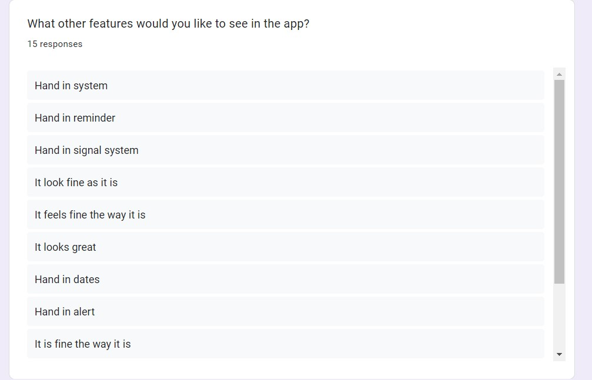

# Student Time Helper

Author: Radoslav Takvoryan 
Student Number: 14975726

Link to the Hosted website: https://com-623-assessment.web.app/login

Git Repository link: https://github.com/Radoslav22/COM623_AE2

## Introduction

The Student Time Helper aims to keep students focused on their work and assignments and improve their time management skills. For the students interviewed in the previous paper, managing their time is challenging because they are juggling tasks or do not have the habits to organise their work well. As a result of the volume of assessments, students sometimes have trouble handling the pressure and managing their time effectively, resulting in lower grades. The application is simple and focused on time management to help the student achieve better grades. The application is primarily designed for mobile devices, based on the answers from my previous paper.

The web application is created using React, Firebase and the open-source React components library MUI (https://mui.com/material-ui/getting-started/overview/). Professional tools and techniques are used and the application follows modern application standards. As the web application is intended to be used while doing assessments and different tasks, it is entirely mobile-friendly and specifically designed for devices with a width of 393 pixels. Although the React library is used and has responsive vision, it could also be used on a desktop version. Positive feedback was received from the Figma testing prototype and the prototype on Figma is followed to achieve the best of the app.

## Methodology

The methodology followed during the development phase was waterfall methodology (https://business.adobe.com/blog/basics/waterfall#:~:text=The%20Waterfall%20methodology%20%E2%80%94%20also%20known,before%20the%20next%20phase%20begins.). Because of the scheduling by using waterfall process, the project will be kept within set time constraints to meet the deadline. The first two phases "Requirements" and "Design" of the methodology have been completed in my previous paper (AE1). The upcoming two stages "Implementation" and "Testing" are going to be followed during the implementation of this assessment (AE2), however, the final phase of the methodology "Maintenance" will be implemented in the future.

[Waterfall diagram](https://business.adobe.com/blog/basics/waterfall#:~:text=The%20Waterfall%20methodology%20%E2%80%94%20also%20known,before%20the%20next%20phase%20begins.)

### Methods

The evaluation of the proposed solution will be based on collecting a mixture of qualitative and quantitative data (https://www.simplypsychology.org/qualitative-quantitative.html) using online surveys which will follow the Solent University ethical consideration. All of the participants in the project are going to be carefully acquainted with the purpose of the survey and with the ethical consideration of the university. All of the participant's responses will be anonymous and make sure that there are no real names or any other information with which the participant will be easily recognised. The Sample size of the survey is at least 15 participants. The target participants are a student which is currently studying at university. The survey will be shared on social platforms with students in order to make sure the sample size target is met. It is not possible to conduct more studies on the probability that the application will solve the problem stated above, due to the limited time. As soon as the results of the surveys have been collected, the conclusion will be based on the collected data.

## Conclusion/Results

The result conducted from the study evaluates the proposed solution and proof the ability to solve the defined solution above. The participants from the survey were able to sign up, using third-party authentications such as google, in the system using their google account or using the functionality for signing up using email. Using the app bar at top of the screen they can easily navigate through all of the screens in the application, as well, if they want to log out from the application. On the home screen, they can easily navigate through the functions of the app such as Calendar, Timer, and Checklist. The timer screen is an interesting function that can help the students to be more focused and productive while doing tasks. The updated method during the pandemic of 52/17 to 112/26 is used in this app which. The 112 minutes of work and 26 minutes break, according to (Julia Gifford, 10 August 2021, Available from:https://desktime.com/blog/52-17-updated-people-are-now-working-and-breaking-longer-than-before) the top 10% productive individuals are working using the new productivity ratio. Due to this, the users of the application are given 112 minutes to work and 26 minutes to take a break. On the calendar screen, they can check how many tasks they have to do, when is the deadline and when is the end time. Another feature that the participants have tried is the addition of new events to the list of tasks.

The first question in the survey revealed that most of the participants liked the overall design.

The next question reveals really interesting insights. The timer is the most liked part of the application according to the results from the survey with almost 50%, in second place is the displaying of the task list.

In the third question, we can clearly see that the participants' opinion is that the application is simple to use.

The fourth question revealed that nearly 94% of the participants do not find any difficulties using the application and nearly 6% selected yes. 

The next question is about do the participants are going to use the application in the future. From 15 responses 8 answers are for "Yes" and the other 7 are for "No".

The sixth question is asking the participants for their opinion. Will the application help the students to achieve better grades? The answers are very interesting because 10 out of 15 correspondents answered "Yes" and the other 5 answered "No".

In the final question, the participant has the option to give their own idea for a feature that is missing in the application. Some of them want reminders and hand-in alerts, however, others think that the application is fine.

In conclusion, based on the study from (AE1) and the study in this paper, it is sure that there is a need for this application across students. It seems that the proposed "Student Time Helper" will be an excellent solution to the problem reviewed in AE1 and stated above. For sure the application could be improved, and in future developments can be added new features for a better experience for the user like the suggested features in the questionary.